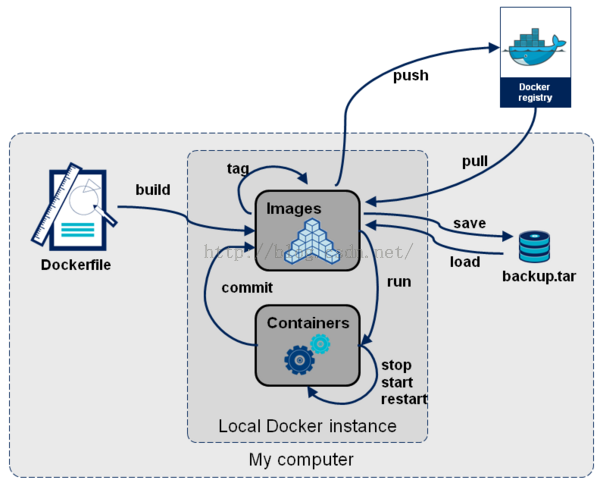
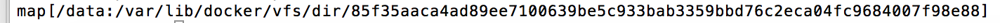
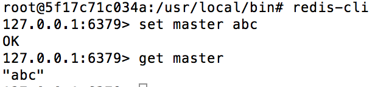
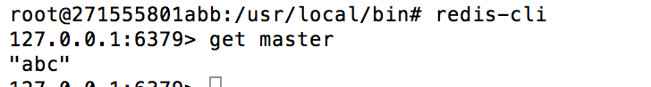

# docker-study
## docker基本命令
+ docker info & docker version 

> docker info命令用于检查docker是否正确安装，如果正确安装，该命令会输出docker的配置信息  
docker info命令一般结合docker version命令使用，两者结合使用能够提取到足够详细的docker环境信息。  

+ docker run  

> docker run命令使用方法如下:  
docker run[OPTIONS] IMAGE [COMMAND][ATG...]  
docker run命令是docker的核心命令之一，用来基于特定的镜像创建一个容器，并依据选项来控制该容器。  

+ docker start/stop/restart命令  

> docker run命令可以新建一个容器来运行，而对于已经存在的容器，可以通过docker start/stop/restart命令来启动，停止和重启。  

+ docker images命令  

> 通过docker images命令可以列出主机上的镜像，默认只列出最顶层的镜像，可以使用-a选项显示所有镜像。  

+ docker rmi 和 docker rm命令  

> 这两个子命令的功能都是删除，docker rmi命令用于删除镜像，docker rm命令用于删除容器。它们可以同时删除多个镜像或容器，也可以按条件来删除。  
  需要注意的是，使用rmi命令删除镜像时，如果已有基于该镜像启动的容器存在，则无法直接删除，需要首先删除容器。  
  
+ docker attach命令  

> 它可以链接到正在运行的容器，观察该容器的运行情况，或与容器的主进程进行交互。  

+ docker inspect命令  

> docker inspect命令可以查看镜像和容器的详细信息，默认会列出全部信息，可以通过--format参数来指定输出的模版格式，以便输出特定信息。

+ docker ps命令  

> 可以查看容器的相关信息，包括CONTAINER ID,NAMES,IMAGE,STATUS,容器启动后执行的COMMAND,创建时间和绑定开启的端口PORTS  

+ docker commit命令  

> commit命令可以将一个容器固化为一个新的镜像。当需要制作特定的镜像时，会进行修改容器的配置，如在容器中安装特定工具等，通过commit命令可以将这些修改保存起来，使其不会因为容器的停止而丢失。  

+ docker events/history/logs命令

> events会打印出实时的系统事件;history命令会打印出指定的镜像的历史版本信息，即构建该镜像的每一层镜像的命令纪录;logs命令会打印出容器中的进程的运行日志  

+ docker命令结构图  


## 搭建应用栈   
Docker的设计理念是希望用户能够保证一个容器只运行一个进程，即只提供一种服务。然而，对于用户而言，单一容器是无法满足需求的。通常用户需要利用多个容器，分别提供不同的服务，并在不同容器互相通信，最后形成一个docker集群，以实现特定功能。下面我们会在一台机器上搭建简化版docker集群。
### redis集群
+ 拉取redis镜像
```
sudo docker pull redis
```
+ 启动redis容器
```
sudo docker run -it --name redis-master redis /bin/bash
```  
按组合键Ctrl+P+Q退出容器  
```
sudo docker run -it --name redis-slave1 --link redis-master:master redis /bin/bash
```  
按组合键Ctrl+P+Q退出容器
```
sudo docker run -it --name redis-slave2 --link redis-master:master redis /bin/bash
```  
    -i 表示交互模式  
    -t 表示分配一个伪终端，一般两个参数结合时使用-it,即可在容器中利用打开的伪终端进行交互操作;  
    --name 可以指定docker run命令启动容器的名字，若无次选项，Docker将为容器随机分配一个名字;  
    -link 建立容器间的互联关系，使用格式为你name:alias(化名)。  
+ 查看挂载目录  
```
sudo docker inspect --format "{{ .Volumes }}" containerID
```


+ 进入master挂载目录，创建redis.conf文件
```
cd xxx
vim redis.conf
```
[master配置文件](https://github.com/shadow88sky/docker-study/blob/master/redis.master.conf)

+ 进入master docker容器
```
docker attach containerID    //进入容器
cd /data  //进入容器中的volume目录
cp redis.conf /usr/local/bin   //copy conf文件
cd /usr/local/bin  
redis-server redis.conf   //启动redis
```

+ redis slave的配置同master基本一致，区别就是redis.conf多加一行
```
slaveof master 6379
```
[slaveof配置文件](https://github.com/shadow88sky/docker-study/blob/master/redis.slave.conf)  

+ 测试redis集群  

    master添加key  
  

    slaveof获取value值  


