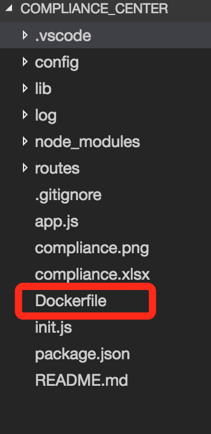
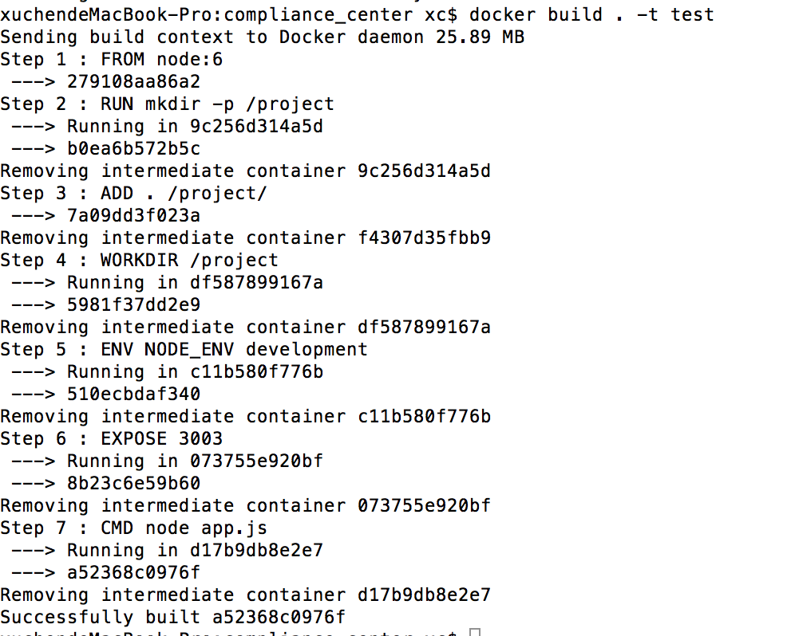

# docker入门
## docker是什么  

        根据官方的定义，Docker是以Docker容器为资源分割和调度的基本单位，封装整个软件运行时环境，为开发者和系统管理员设计的，用于构建，发布和运行发布式应用的平台。
        它是一个跨平台，可移植并且简单易用的容器解决方案。Docker的源代码托管在GitHub上，基于Go语言开发并遵从Apache2.0协议。Docker可在容器内部快速自动化地部署应用，并通过
        系统内核技术为容器提供资源隔离和安全保障。  

## 什么是docker镜像  

        Docker镜像是一个只读的Docker容器模板，含有启动Docker容器所需的文件系统结构及其内容，因此是启动一个Docker容器的基础。可以这么理解,    
        Dokcer镜像是Docker容器的静态视角，Docker容器是docker镜像的运行状态。

## docker基本命令
+ docker info & docker version 

> docker info命令用于检查docker是否正确安装，如果正确安装，该命令会输出docker的配置信息  
docker info命令一般结合docker version命令使用，两者结合使用能够提取到足够详细的docker环境信息。  

+ docker run  

> docker run命令使用方法如下:  
docker run[OPTIONS] IMAGE [COMMAND][ATG...]  
docker run命令是docker的核心命令之一，用来基于特定的镜像创建一个容器，并依据选项来控制该容器。  

+ docker start/stop/restart命令  

> docker run命令可以新建一个容器来运行，而对于已经存在的容器，可以通过docker start/stop/restart命令来启动，停止和重启。  

+ docker images命令  

> 通过docker images命令可以列出主机上的镜像，默认只列出最顶层的镜像，可以使用-a选项显示所有镜像。  

+ docker rmi 和 docker rm命令  

> 这两个子命令的功能都是删除，docker rmi命令用于删除镜像，docker rm命令用于删除容器。它们可以同时删除多个镜像或容器，也可以按条件来删除。  
  需要注意的是，使用rmi命令删除镜像时，如果已有基于该镜像启动的容器存在，则无法直接删除，需要首先删除容器。  
  
+ docker attach命令  

> 它可以链接到正在运行的容器，观察该容器的运行情况，或与容器的主进程进行交互。  

+ docker inspect命令  

> docker inspect命令可以查看镜像和容器的详细信息，默认会列出全部信息，可以通过--format参数来指定输出的模版格式，以便输出特定信息。

+ docker ps命令  

> 可以查看容器的相关信息，包括CONTAINER ID,NAMES,IMAGE,STATUS,容器启动后执行的COMMAND,创建时间和绑定开启的端口PORTS  

+ docker commit命令  

> commit命令可以将一个容器固化为一个新的镜像。当需要制作特定的镜像时，会进行修改容器的配置，如在容器中安装特定工具等，通过commit命令可以将这些修改保存起来，使其不会因为容器的停止而丢失。  

+ docker events/history/logs命令

> events会打印出实时的系统事件;history命令会打印出指定的镜像的历史版本信息，即构建该镜像的每一层镜像的命令纪录;logs命令会打印出容器中的进程的运行日志  

+ docker命令结构图  


## 搭建应用栈   
Docker的设计理念是希望用户能够保证一个容器只运行一个进程，即只提供一种服务。然而，对于用户而言，单一容器是无法满足需求的。通常用户需要利用多个容器，分别提供不同的服务，并在不同容器互相通信，最后形成一个docker集群，以实现特定功能。下面我们会在一台机器上搭建简化版docker集群。
### redis集群
+ 拉取redis镜像
```
sudo docker pull redis
```
+ 启动redis容器
```
sudo docker run -it --name redis-master redis /bin/bash
```  
按组合键Ctrl+P+Q退出容器  
```
sudo docker run -it --name redis-slave1 --link redis-master:master redis /bin/bash
```  
按组合键Ctrl+P+Q退出容器
```
sudo docker run -it --name redis-slave2 --link redis-master:master redis /bin/bash
```  
    -i 表示交互模式  
    -t 表示分配一个伪终端，一般两个参数结合时使用-it,即可在容器中利用打开的伪终端进行交互操作;  
    --name 可以指定docker run命令启动容器的名字，若无次选项，Docker将为容器随机分配一个名字;  
    -link 建立容器间的互联关系，使用格式为你name:alias(化名)。  
+ 查看挂载目录  
```
sudo docker inspect --format "{{ .Volumes }}" containerID
```


+ 进入master挂载目录，创建redis.conf文件
```
cd xxx
vim redis.conf
```
[master配置文件](https://github.com/shadow88sky/docker-study/blob/master/redis.master.conf)

+ 进入master docker容器
```
docker attach containerID    //进入容器
cd /data  //进入容器中的volume目录
cp redis.conf /usr/local/bin   //copy conf文件
cd /usr/local/bin  
redis-server redis.conf   //启动redis
```

+ redis slave的配置同master基本一致，区别就是redis.conf多加一行
```
slaveof master 6379
```
[slaveof配置文件](https://github.com/shadow88sky/docker-study/blob/master/redis.slave.conf)  

+ 测试redis集群  

    master添加key  
  

    slaveof获取value值  
  

## Dockerfile的使用  
        docker build构建镜像时，其参数有三种类型(PATH,-,URL)，表示构建上下文的三种来源。  
        一般情况下，将本地主机的一个包含Dockerfile的目录中的所有内容作为上下文。上下文通过docker build命令传入  
        到Docker daemon后，便开始按照Dockerfile中的内容构造镜像。  

### Dockerfile指令  

+ ENV  

        格式: ENV<key><value>或ENV<key><value> 

        ENV指令可以为镜像创建出来的容器声明环境变量。并且在Dockerfile中，ENV指令声明的环境变量会被后面的特定指令(  
        即ENV,ADD,COPY,WORKDIR,EXPOSE,VOLUME,USER)解释使用。其他指令使用环境变量时，使用格式为$variable_name  
        或者${variable_name}。在变量前面添加斜杠\可以转义，如\$foo或者\${foo},将会被分别转换为$foo或者${foo},  
        而不是环境变量所保存的值。另外，ONBUILD指令不支持环境变量。  

+ FROM  

        格式:FROM<image>或FROM<image>:<tag>  

        FROM指令的功能是为后面的指令提供基础镜像，因此一个有效的Dockerfile必须以FROM指令作为第一条非注释指令。从公共  
        镜像库中拉取镜像很容易，基础镜像可以选择任何有效的镜像。在一个Dockerfile中，FROM指令可以出现多次，这样会构建多个  
        镜像。在每个镜像创建完成后，Docker命令行界面会输出该镜像的id。若FROM指令中参数tag为空，则tag默认是latest;若  
        参数image或tag指定的镜像不存在，则返回错误。  

+ COPY  

        格式:COPY <src> <dest>  

        COPY指令复制<src>所指向的文件或目录，将它添加到新的镜像中，复制的文件或目录在镜像中的路径是<dest>。  
        若<dest>以反斜杠/结尾则其指向的是目录;否则指向文件。  

+ ADD  

        格式:ADD <src> <dest>  

        ADD和COPY类似，但还支持其他的功能。例如<src>可以指向一个网络文件的url或者一个本地压缩的归档文件。  

+ RUN  

        有两种格式:  
        RUN <command> (shell格式)  
        RUN ["executable","param1","param2"] (excel格式，推荐格式)  

        RUN指令会在前一条命令创建出的镜像的基础上创建一个容器，并在容器中运行命令，在命令结束运行后提交容器为  
        新镜像，新镜像被Dockerfile中的下一条指令使用。  

+ CMD  

        三种格式:  
        CMD <command> (shell格式)  
        CMD ["executable","param1","param2"] (excel格式，推荐格式)  
        CMD ["param1","param2"] (为ENTRYPOINT指令提供参数)  

        CMD指令提供容器运行时的默认值，这些默认值可以是一条指令，也可以是一些参数。一个Dockerfile中可以有多条  
        CMD指令，但只有最后一条CMD指令有效。和RUN不同处在于，RUN指令在构建镜像时执行命令，并生成新的镜像;CMD  
        在构建镜像时并不执行任何命令，而是在容器启动时默认将CMD指令作为第一条执行的命令。  

### 通过Dockerfile构建Node镜像(demo)  
+ 在Node的根目录下面创建文件，名叫Dockerfile  
  

+ 编辑dockerfile  
        
```        
        FROM node:6

        RUN mkdir -p /project
        ADD . /project/
        WORKDIR /project

        ENV NODE_ENV development
        EXPOSE 3003

        CMD ["node", "app.js"]
```

+ 根目录创建镜像  
        docker build . -t test  

+ 启动镜像
  

